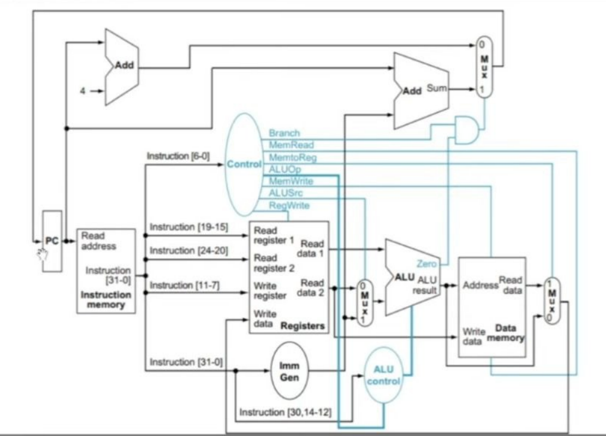

# Single Cycle RISC-V Processor

## Overview
This project implements a 32-bit single cycle RISC-V processor using Verilog HDL.  
The processor was designed and simulated in Vivado and later implemented on FPGA.

The processor supports arithmetic operations, memory access operations and branching instructions.

---

## Features
- 32-bit single cycle architecture
- 32 register register-file
- ALU operations
- Instruction and data memory
- Branching support
- Seven segment display output
- FPGA implementation

---

## Supported Instructions

### R-Type
- add
- sub
- and
- or

### I-Type
- addi

### Load/Store
- lw
- sw

### Branch
- beq

---

## Modules
- PC_Register
- PCplus4
- Instruction_Mem
- Reg_File
- ImmGen
- Control_Unit
- ALU_Control
- ALU_unit
- Data_Memory
- Mux
- Adder
- AND_logic
- SevenSeg
- Top Module

---

## Simulation
The processor was verified using Vivado simulation.

### Implemented Programs
- Sum of first N natural numbers
- Fibonacci sequence

---

## FPGA Implementation
The processor was implemented on FPGA and outputs were displayed on seven segment display.

Input values were provided using onboard switches.

---

## Datapath

---

## Tools Used
- Verilog HDL
- Xilinx Vivado
- FPGA Development Board
